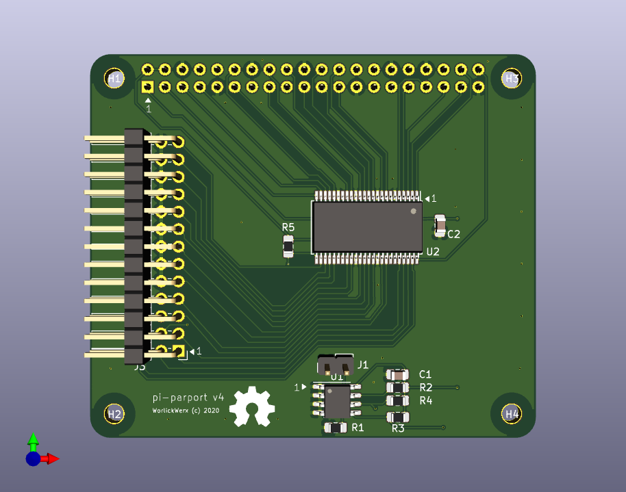

## pi-parport

This is a Raspberry Pi HAT that implements a PC-style parallel port.
GPIO pins are organized as data, status, and control registers.
The HAT includes a buffer chip that converts from the GPIB 3V3 logic
to signals that conform to IEEE 1284.  A 26 pin IDC header on the
board connects to your DB25 connector.  A `parport-gpio` driver and
device tree overlay integrate the HAT with the Linux parport driver stack.




### Why?

I wanted to use a parallel port based cooled astronomy camera,
but preferred to use the compact and low-power Raspberry Pi
over a PC at the telescope.  Parallel ports are simple devices.
Why not build one?

### What works?

See [wiki](https://github.com/worlickwerx/pi-parport/wiki) for notes on some
devices, and please share your experience if you try something new.

The following limitations of this implementation may affect software and
hardware that uses the parallel port:
1) The software cannot directly read and write the x86 port addresses,
as was the custom early on.  In user space, software must use the ppdev
ioctl interface.  In the kernel, software must use the (generic)
`struct parport` operations.
2) The GPIO multiplexing/de-multiplexing and/or system call access may
impact the direct-access latency assumed by some bit-banged drivers.
On a Pi 3, user space code can toggle a parallel port line at about 250 kHz.

### Why not use a USB Parallel Port?

Many USB parallel port devices appear to Linux as a USB printer, bypassing
the parport driver stack.  If your application is a printer, go for it.

### Building the driver

For convenience, the generic parport code is duplicated in this repo,
since the Raspberry Pi Foundation does not ship the compiled modules in
the `raspberrypi-kernel` package.

Clone this repo, then run the following with `${TOPDIR}` representing the
top level directory of the cloned repo:
```console
$ sudo apt install build-essential raspberrypi-kernel-headers
$ cd ${TOPDIR}/driver
$ make
make -C /lib/modules/4.19.75-v7+/build M=${TOPDIR}/driver modules
make[1]: Entering directory '/usr/src/linux-headers-4.19.75-v7+'
  CC [M]  ${TOPDIR}/driver/parport/share.o
  CC [M]  ${TOPDIR}/driver/parport/ieee1284.o
  CC [M]  ${TOPDIR}/driver/parport/ieee1284_ops.o
  CC [M]  ${TOPDIR}/driver/parport/procfs.o
  CC [M]  ${TOPDIR}/driver/parport/daisy.o
  CC [M]  ${TOPDIR}/driver/parport/probe.o
  LD [M]  ${TOPDIR}/driver/parport/parport.o
  CC [M]  ${TOPDIR}/driver/parport/lp.o
  CC [M]  ${TOPDIR}/driver/parport/ppdev.o
  CC [M]  ${TOPDIR}/driver/parport_gpio.o
  Building modules, stage 2.
  MODPOST 4 modules
  CC      ${TOPDIR}/driver/parport/lp.mod.o
  LD [M]  ${TOPDIR}/driver/parport/lp.ko
  CC      ${TOPDIR}/driver/parport/parport.mod.o
  LD [M]  ${TOPDIR}/driver/parport/parport.ko
  CC      ${TOPDIR}/driver/parport/ppdev.mod.o
  LD [M]  ${TOPDIR}/driver/parport/ppdev.ko
  CC      ${TOPDIR}/driver/parport_gpio.mod.o
  LD [M]  ${TOPDIR}/driver/parport_gpio.ko
make[1]: Leaving directory '/usr/src/linux-headers-4.19.75-v7+'
```

### Installing the Device Tree Overlay

The device tree overlay maps specific GPIO pins to their functions in
the driver.  This must be compiled and loaded:
```console
$ cd ${TOPDIR}/dts
$ make
$ sudo make install
```
then add the following line to `/boot/config.txt`:
```
dtoverlay=parport-gpio
```
Then reboot the pi to pick up the new config.

### Loading the Modules

After rebooting, load the base modules:
```console
$ cd ${TOPDIR}
$ sudo insmod parport/parport.ko
$ sudo insmod parport_gpio.ko
```
You'll see the port announce itself on the console:
```console
[4425200.988400] parport-gpio ppgpio@0: data on pins [22,23,24,10,25,9,8,11]
[4425200.988412] parport-gpio ppgpio@0: status on pins [18,17,4,3,2]
[4425200.988422] parport-gpio ppgpio@0: control on pins [26,19,6,13]
[4425200.988430] parport-gpio ppgpio@0: hd on pin 20
[4425200.988438] parport-gpio ppgpio@0: dir on pin 21
```
If you wish to set up a parallel printer:
```console
$ sudo insmod parport/lp.ko
```
If you wish to run user-space programs that use the parallel port:
```console
$ sudo insmod parport/ppdev.ko
```

### hardware

The latest hardware includes an ID EEPROM to conform with the
[Raspberry Pi HAT Specification](https://github.com/raspberrypi/hats),
and was designed with [KiCAD](https://www.kicad-pcb.org/).
As with the previous version, the
[SN74LVC161284 19-bit bus interface with 3-state outputs](http://www.ti.com/product/SN74LVC161284) takes care of buffering and line conditioning.

This version is shared on
[OSHPARK](https://oshpark.com/shared_projects/gevwv2YP).
See the [Bill of Materials](hardware_v3/BOM.md) for parts to place on
the board.

Populating the EEPROM and associated components on a board you're making
yourself is optional.

Schematics and design files for [previous versions](hardware_old/)
are still available for reference.

### Release

Share and enjoy!

#### Software License

SPDX-License-Identifier: GPL-2.0-or-later

#### Hardware License

SPDX-License-Identifier: CERN-OHL-1.2
